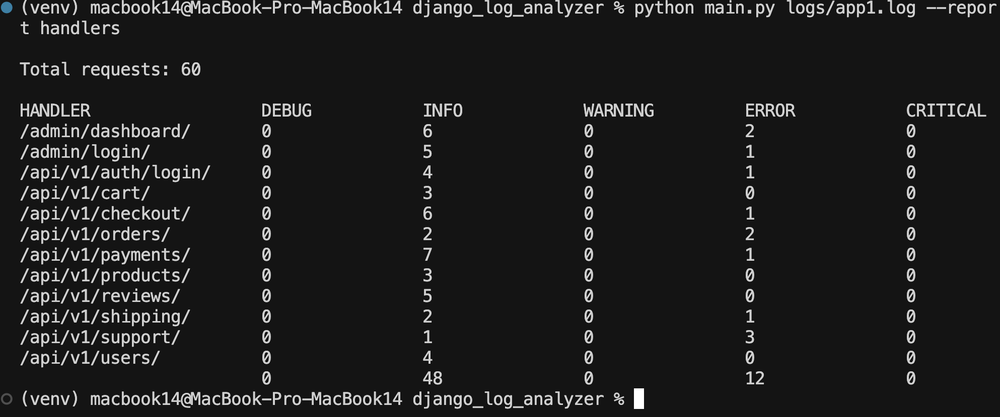
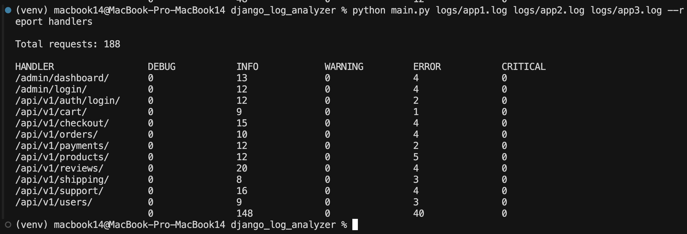

# Django Log Analyzer

CLI-приложение для анализа логов Django-приложения и формирования отчетов о состоянии API-эндпоинтов.

## Возможности

- Анализ одного или нескольких лог-файлов Django
- Параллельная обработка файлов для высокой производительности
- Формирование отчета о состоянии API-эндпоинтов
- Группировка по уровням логирования (DEBUG, INFO, WARNING, ERROR, CRITICAL)
- Сортировка эндпоинтов в алфавитном порядке

## Требования

- Python 3.8+
- Django 3.2+

## Установка

1. Клонируйте репозиторий:
```bash
git clone https://github.com/username/django-log-analyzer.git
cd django-log-analyzer
```

2. Создайте виртуальное окружение и активируйте его:
```bash
python -m venv venv
source venv/bin/activate  
```

3. Установите зависимости:
```bash
pip install -r requirements.txt
pip install -r requirements-dev.txt  # для разработки
```

## Использование

### Базовое использование

```bash
python main.py logs/app1.log --report handlers
```

### Анализ нескольких файлов

```bash
python main.py logs/app1.log logs/app2.log logs/app3.log --report handlers
```

### Запуск тестов

```bash
# Запуск всех тестов
python -m pytest

# Запуск тестов с отчетом о покрытии
python -m pytest --cov=src tests/ -v
```

Проект имеет модульную архитектуру:

- `cli.py` - обработка аргументов командной строки
- `core/`
  - `parser.py` - парсинг лог-файлов
  - `processor.py` - параллельная обработка файлов
- `reports/`
  - `base.py` - базовый класс для отчетов
  - `handlers.py` - отчет по API-эндпоинтам

### Добавление нового отчета

1. Создайте новый класс в директории `reports/`:
```python
from .base import BaseReport

class MyNewReport(BaseReport):
    def generate(self, log_data):
        # логика генерации отчета
        pass
```

2. Добавьте новый тип отчета в CLI (`cli.py`):
```python
parser.add_argument(
    "--report",
    choices=["handlers", "my_new_report"],
    ...
)
```

## Примеры использования

### Анализ одного файла


### Анализ нескольких файлов

